# PagePerso@Kubernetes

This repository contains scripts and configuration files that helped
me to host my personal website on Kubernetes. The purpose of this
work was to understand the concepts involved in an application
running on Kubernetes.

## Objective

- Make a website hosted on Dropbox available online
- Learn the basics of Kubernetes
- Use a commercial Kubernetes service (Scaleway's Kapsule)
- Use traefik as the ingress controller
- (bonus) Automatize the creation of DNS certificates for the hosted services

## Prerequisites

- a Dropbox account
- a valid domain name

## Steps (15 minutes)

### 0) Create a Kubernetes cluster on Scaleway

Create an account on [scaleway](https://www.scaleway.com), login and browse to the dashboard page.

The service in charge of the creation of Kubernetes cluster is
labelled *Kapsule*. Browse to the *Kapsule* tab and proceed with the
creation of a new cluster:

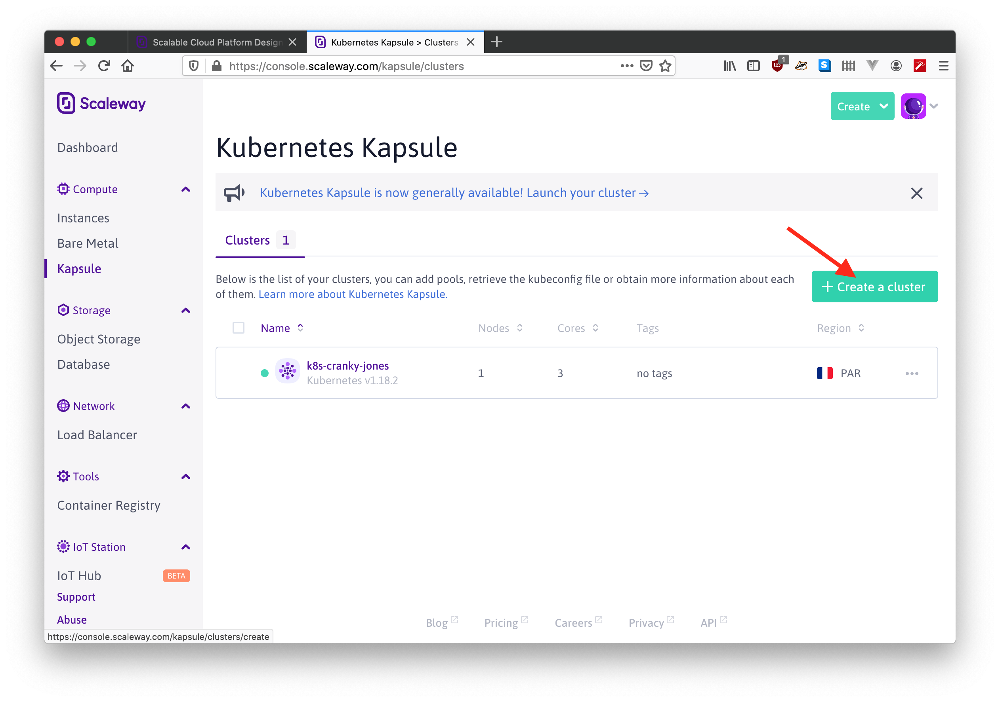

Select *DEV-M* as this is the cheapest flavor of virtual machine available on Scaleway (7.99€/month):

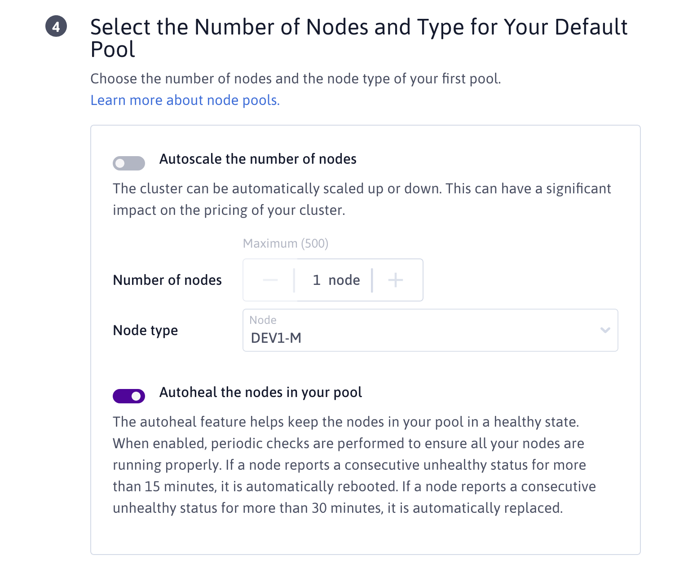

Select [traefik](https://containo.us/traefik/) as the ingress controller of the new Kubernetes cluster:

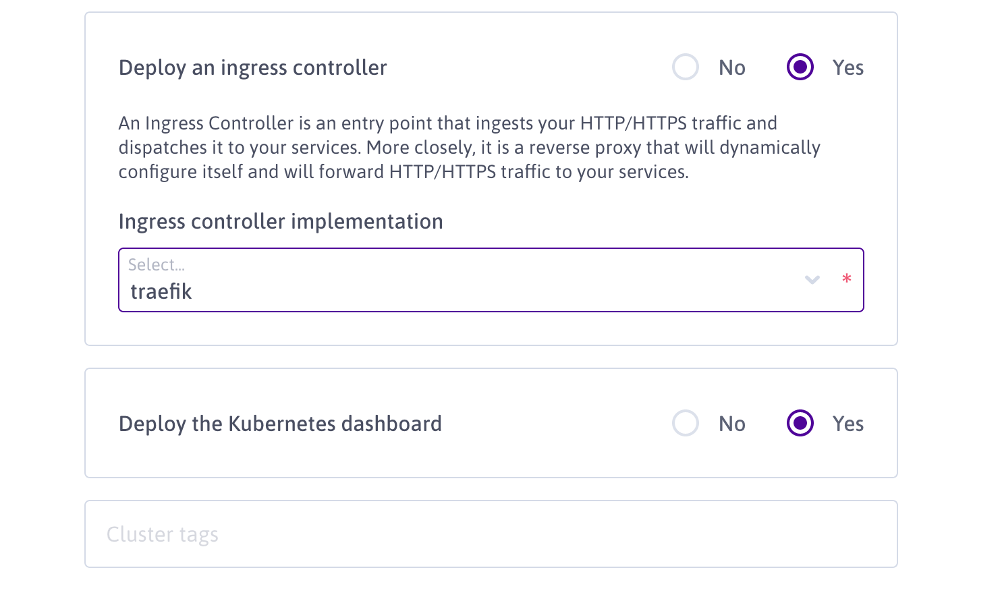

Check the configuration parameters of the cluster, and if it matches what is expected, proceed with the creation:

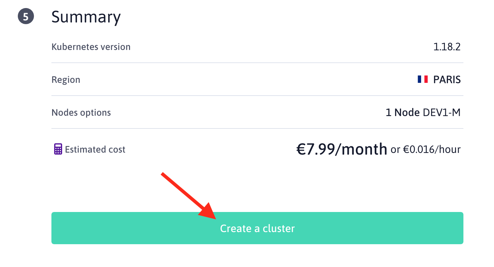

After few minutes, the cluster should be available in your dashboard:

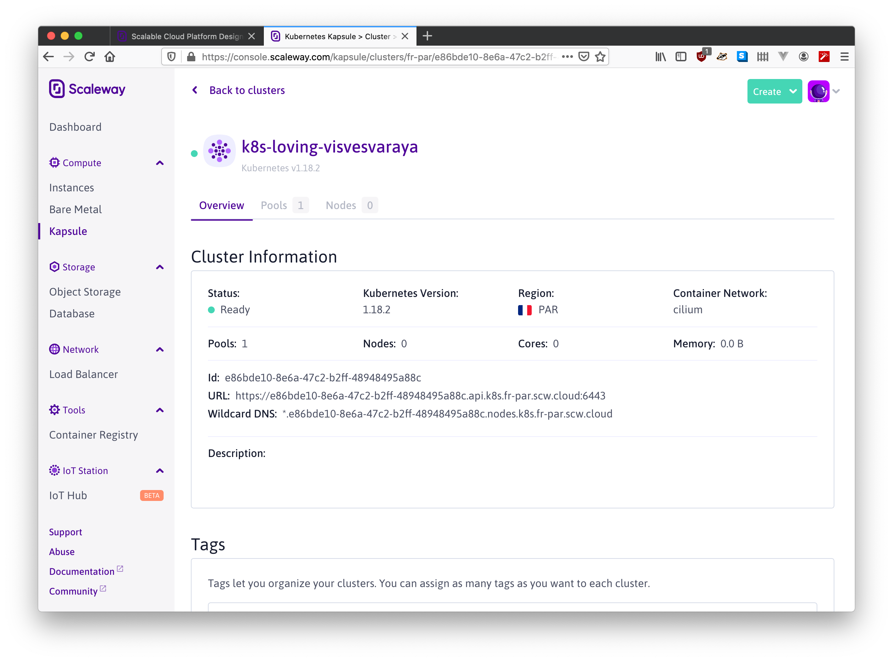

Before proceeding with the rest, download the config file of the Kubernetes cluster and move it to `~/.kube/config`:

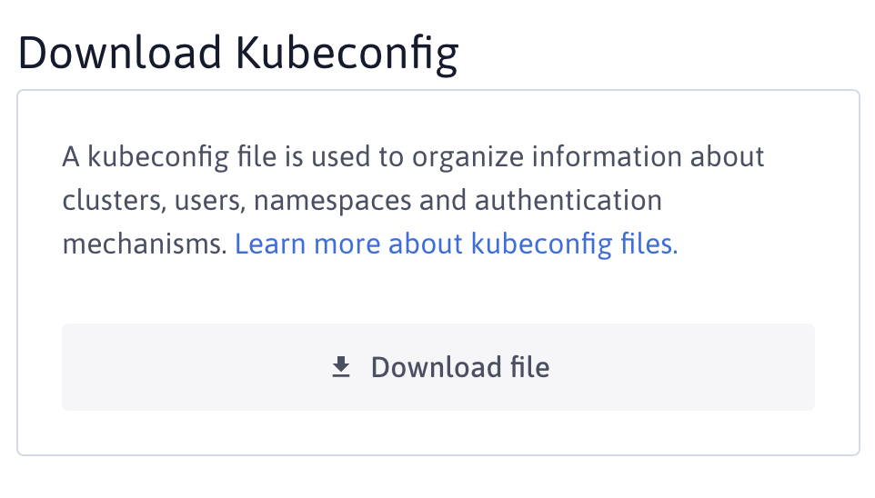

Check that you can interact with your Kubernetes cluster with the [kubectl](https://kubernetes.io/fr/docs/tasks/tools/install-kubectl/) command:

```shell
kubectl get pods
```


### 1) Create an access Token for your dropbox account

The service that we will deploy on Kubernetes needs an access to your
dropbox folder. To do so, it uses the [rclone](https://rclone.org/) software which is
basically a kind of rsync for cloud storage. The easiest way to enable rclone to
authenticate with Dropbox is to generate an access token.

First connect to the [Dropbox App Console](https://www.dropbox.com/developers/apps) and create a new app:

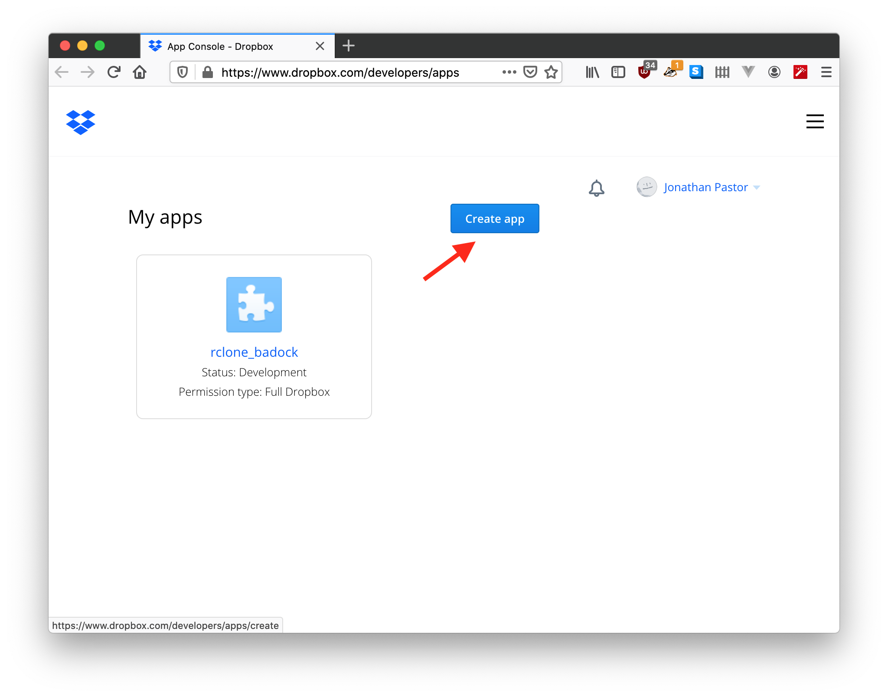

Choose the following parameters

- Dropbox API
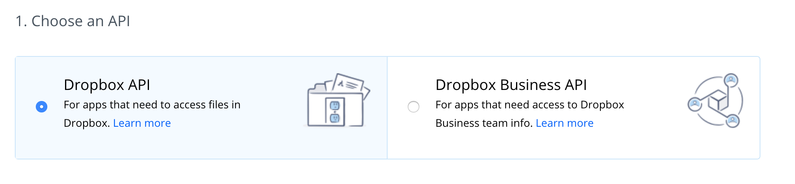
- Full Dropbox
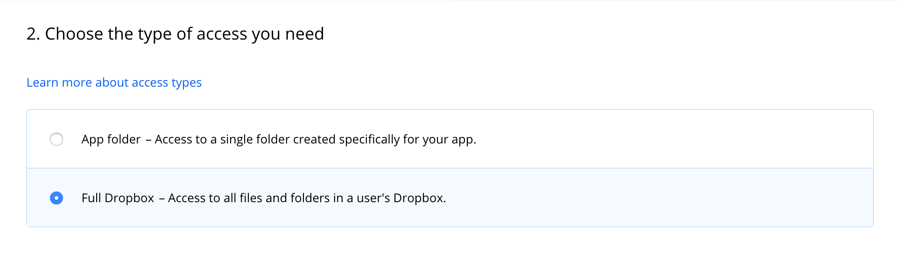
- Set a name
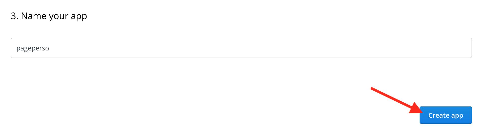

and proceed with the creation of the app.

Browse to the description of your new app, and click on the "Generate" button under the `Generated access token` label:
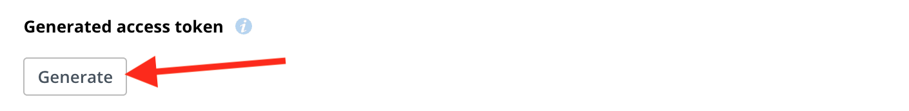

A token should have been generated:
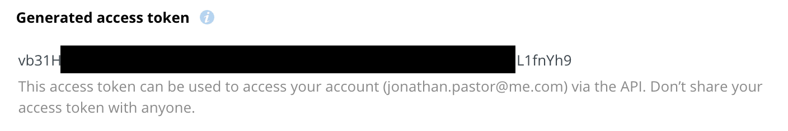

Remember this token. We will refer later to this token as `<TOKEN>`

### 2) Create a secret on Kubernetes that contains the Dropbox's access token

```shell
kubectl create secret generic pageperso-secrets --from-literal=DROPBOX_ACCESS_TOKEN=<TOKEN>
```

### 3) Deploy the 'pageperso' application

```shell
kubectl apply -f pageperso.yaml
```

or to force the redeployment of your service, run the following command:
```shell
kubectl rollout restart deployment/pageperso-deployment
```

### 4) Test it!

edit the `pageperso.yaml` file and change the two hosts

```yaml
---
apiVersion: extensions/v1beta1
kind: Ingress
metadata:
  name: pageperso-ingress
  labels:
    app: pageperso
  annotations:
    kubernetes.io/ingress.class: "traefik"
spec:
  rules:
  - host: about.<CLUSTER_ID>.nodes.k8s.fr-par.scw.cloud
    http:
      paths:
      - path: /
        backend:
          serviceName: pageperso-service
          servicePort: aboutport
  - host: dropbox.<CLUSTER_ID>.nodes.k8s.fr-par.scw.cloud
    http:
      paths:
      - path: /
        backend:
          serviceName: pageperso-service
          servicePort: dropboxport
```

Apply the changes to the cluster:
```shell
kubectl apply -f pageperso.yaml
```

Place an index.html page in `drobpox` and `pageperso` folders on your Dropbox folder.

After few seconds, you should be able to access this page using these URL:
- about.<CLUSTER_ID>.nodes.k8s.fr-par.scw.cloud
- dropbox.<CLUSTER_ID>.nodes.k8s.fr-par.scw.cloud


### 4) Configure a domain name

First configure your domain name to redirect about.<your_domain> and drobpox.<your_domain> to the "Wildcard DNS" zone proposed by scaleway:


edit the `pageperso.yaml` file and define the `Ingress` block as follow:
```yaml
---
apiVersion: extensions/v1beta1
kind: Ingress
metadata:
  name: pageperso-ingress
  labels:
    app: pageperso
  annotations:
    kubernetes.io/ingress.class: "traefik"
spec:
  rules:
  - host: about.<your_domain>
    http:
      paths:
      - path: /
        backend:
          serviceName: pageperso-service
          servicePort: aboutport
  - host: dropbox.<your_domain>
    http:
      paths:
      - path: /
        backend:
          serviceName: pageperso-service
          servicePort: dropboxport
```

Apply the changes to the cluster:
```shell
kubectl apply -f pageperso.yaml
```

After few seconds, you should be able to access this page using these URL:
- about.<your_domain>
- dropbox.<your_domain>

### 5) (bonus) Configure HTTPS

#### a) Install cert-manager

According to the [official documentation](https://cert-manager.io/docs/installation/kubernetes/#installing-with-regular-manifests) of cert-manager, do the following:

```shell
kubectl apply --validate=false -f https://github.com/jetstack/cert-manager/releases/download/v0.14.3/cert-manager.yaml
```

Replace the email adress in the `let_encrypt_issuer.yaml` file and run the command:
```shell
kubectl apply -f let_encrypt_issuer.yaml
```

#### b) Configure the service to use letscrypt to secure the services

edit the `pageperso.yaml` file and define the `Ingress` block as follow:

```yaml
---
apiVersion: extensions/v1beta1
kind: Ingress
metadata:
  name: pageperso-ingress
  labels:
    app: pageperso
  annotations:
    kubernetes.io/ingress.class: "traefik"
    cert-manager.io/issuer: "letsencrypt-prod"
    traefik.ingress.kubernetes.io/redirect-entry-point: https
    traefik.ingress.kubernetes.io/redirect-permanent: "true"
    ingress.kubernetes.io/ssl-redirect: "true"
    ingress.kubernetes.io/ssl-temporary-redirect: "false"
spec:
  tls:
    - hosts:
      - about.jonathanpastor.fr
      - dropbox.jonathanpastor.fr
      secretName: quickstart-example-tls
  rules:
  - host: about.jonathanpastor.fr
    http:
      paths:
      - path: /
        backend:
          serviceName: pageperso-service
          servicePort: aboutport
  - host: dropbox.jonathanpastor.fr
    http:
      paths:
      - path: /
        backend:
          serviceName: pageperso-service
          servicePort: dropboxport
```

Apply the changes to the cluster:
```shell
kubectl apply -f pageperso.yaml
```

## Contact

Feel free to contact me or to open an issue.
